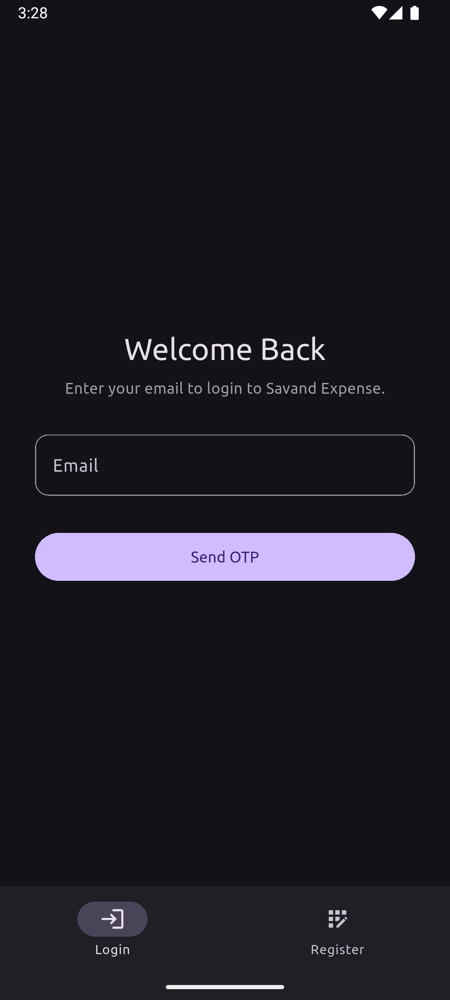
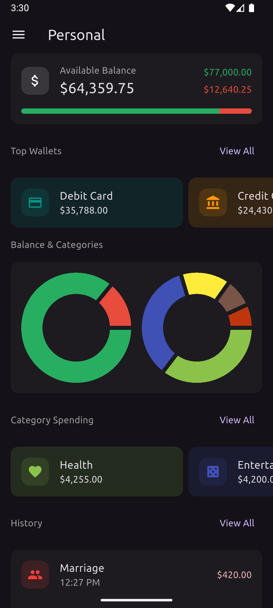
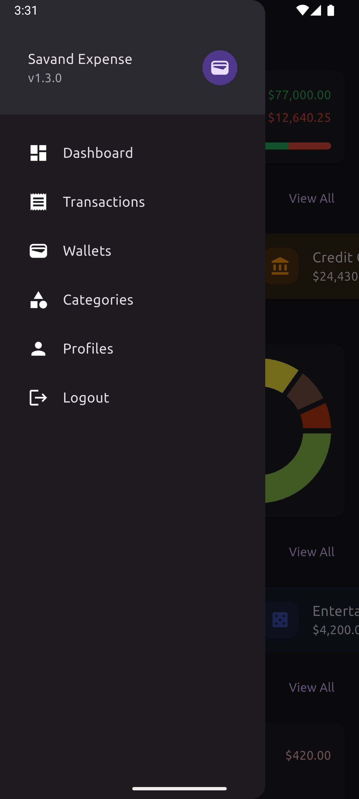
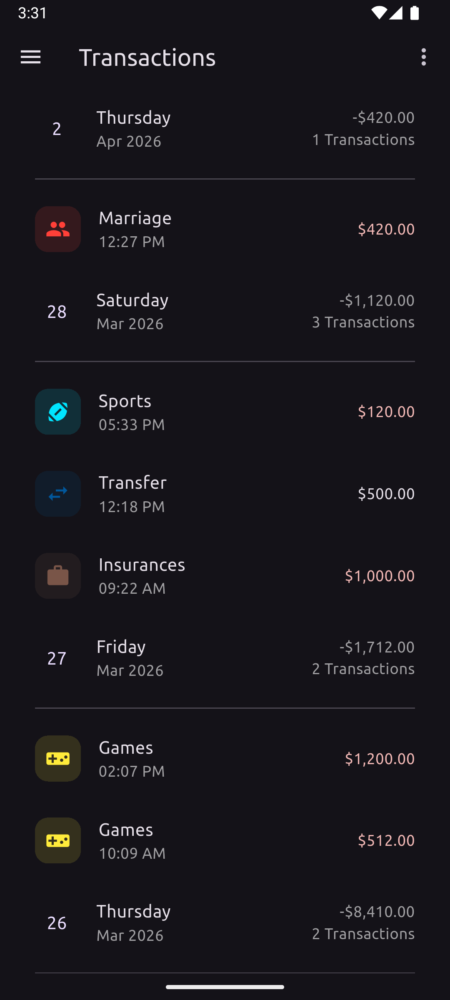
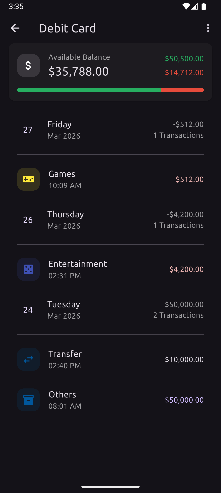
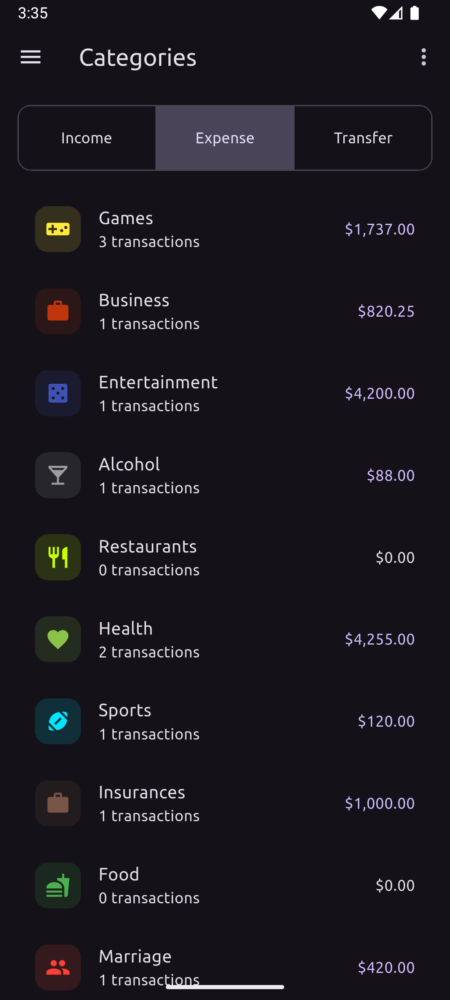
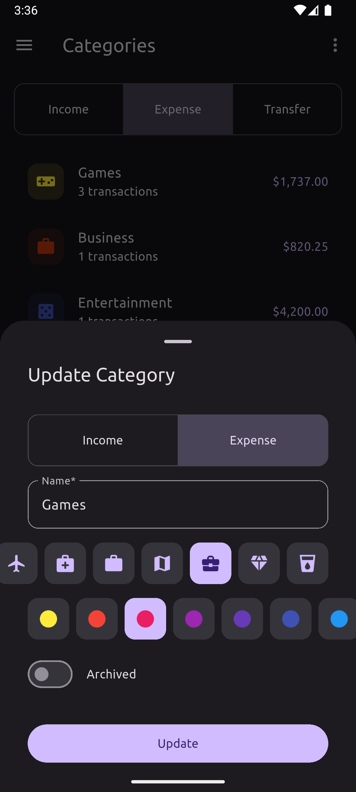
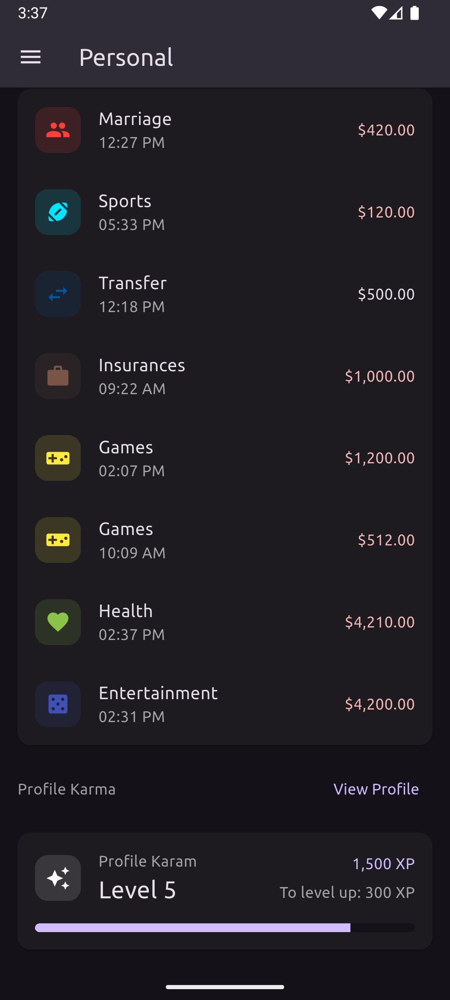

# Expense (mobile)

[🏠 Website](https://savandbros.com/apps/expense)

Mobile (Flutter) source code of Savand Expense.

## Screenshots

|                                                                                       |                                                                                           |                                                                                         |
|:-------------------------------------------------------------------------------------:|:-----------------------------------------------------------------------------------------:|:---------------------------------------------------------------------------------------:|
|        [](./assets/screenshot/1_login.png)        |      [](./assets/screenshot/2_dashboard.png)      |       [](./assets/screenshot/3_sidebar.png)       |
| [](./assets/screenshot/4_transactions.png) |    [](./assets/screenshot/5_transaction.png)    |        [](./assets/screenshot/6_wallet.png)        |
|   [](./assets/screenshot/7_categories.png)   | [](./assets/screenshot/8_category_sheet.png) | [](./assets/screenshot/9_profile-karma.png) |

## Development

**Resources**

- [Architecture](./ARCHITECTURE.md)
- [Testing](./test/README.md)

**Structure**

- [`lib/core/`](./lib/core/README.md)
- [`lib/features/`](./lib/features/README.md)
- [`lib/shared/`](./lib/shared/README.md)

**Tests**

Read [Testing](./test/README.md) for documentation.

**Tech**

Important packages being used:

- `dio`
- `flutter_riverpod`
- `get_it`
- `go_router`
- `flutter_secure_storage`
- `freezed`

**Run**

```
flutter pub get
dart run build_runner build -d
flutter run
```

**Code generation**

- `freezed` + `json_serializable` via `build_runner`

Run once:

```
dart run build_runner build -d
```

Run in watch mode during development:

```
dart run build_runner watch -d
```

**Analyze**

```
flutter analyze
```

**Platforms**

- Android
- iOS

**Icons**

Configuration at `flutter_launcher_icons.yaml`.
Run command to build icons:

```
flutter pub run flutter_launcher_icons
```

**Signed APK**

Create file `./android/key.properties` with this content:

```ini
storePassword=xxx
keyPassword=xxx
keyAlias=xxx
storeFile=xxx
```

Run command to build APK:

```
flutter build apk
```

## Deployment

Releasing a signed APK to website available for download.

---

_Savand Bros &copy; 2026-present_
